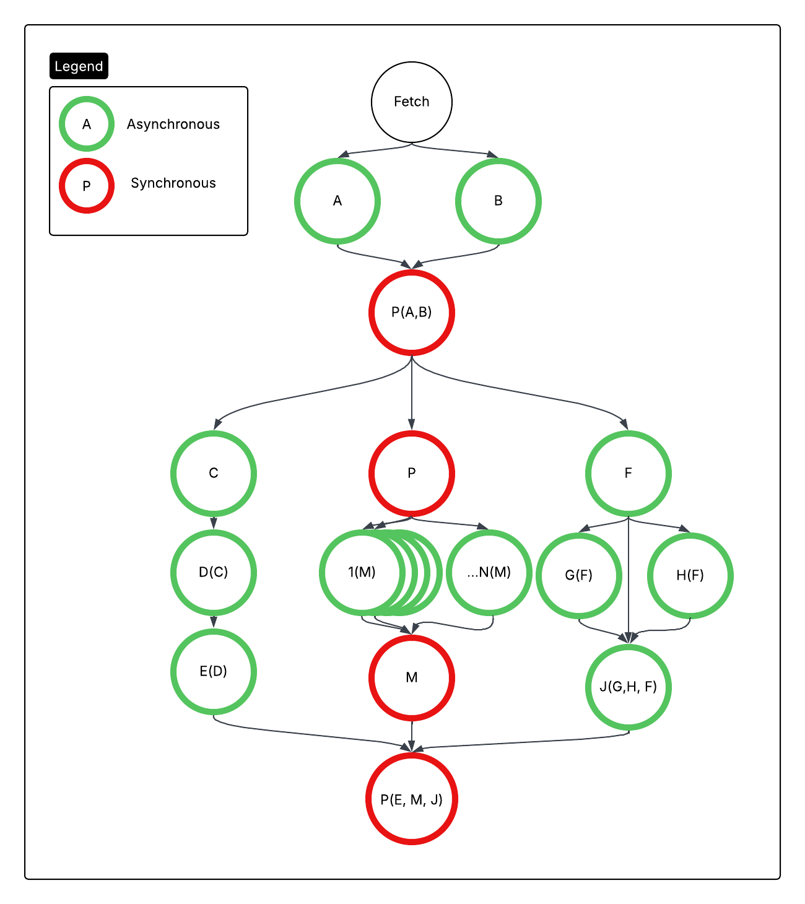

# Concurrency Example
Consider the following scenario:

You serve an endpoint that returns a `List<Document>`.

There are three (3) kinds of documents, Red, Blue, and Green. 

Each document type contains different data from different sources, so each document type requires a different set of queries to populate. 

## Get IDs to Query
First, we query TWO different data sources to figure out WHICH documents to fetch.

`A` is a relational database, and returns a `List<DocumentId, Color>` that we should populate.

`B` is some other service that also returns a `List<DocumentId, Color>`.

Once we have results `a` and `b`, we do some processing _(P(A,B))_ to deduplicate the lists, and then we launch flows to populate the Red, Blue, and Green documents. 

## Red Documents
Red documents get the left path. It's a chain of three asynchronous calls, with each call depending on the results of the previous call. We gradually build up a `List<RedDocument>` through that path. 

## Blue Documents
Blue documents get the middle path. Blue documents are only available via a GET request to some service, and there is no batched option available. We spam one query per blue doc, and collate them together at the end. 

## Green Documents 
Green documents get the right path. One async call gets us `f`, which we then use to query `G(f)` and `H(f)`. Once we have `f, g, h`, we can query `J(f,g,h)` to get the final list of Green documents. 

We collate all the results together at the end and return a List containing all the Red, Blue, and Green documents. 

